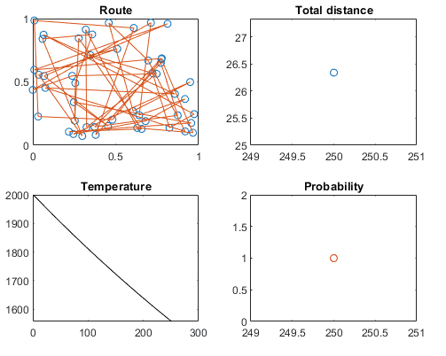

# Travelling Salesman Problem
The TSP is defined as follows: 
"Given a list of cities and the distances between each pair of cities, what is the shortest possible route that visits each city and returns to the origin city?". [[1]](https://en.wikipedia.org/wiki/Travelling_salesman_problem)
This is an **optimization** (minimization) problem, where the objective function is the total length of the route.

## Implementations
In this repository the problem has been solved thanks to the **simulated annealing** algorithm. This has been implemented both in Python and MATLAB.

